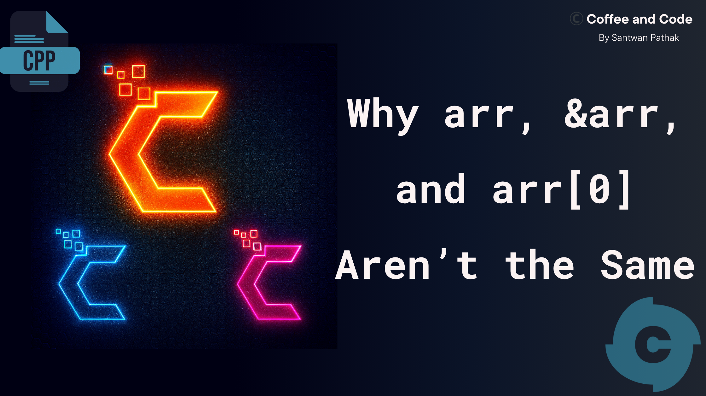

# 📦 Module 11: Arrays

## 📝 Blogs 
<details>
<summary><strong>ALL THE BLOGS LINKS</strong></summary>

# 🔥 Mastering Arrays and Pointers in C++

<a href="https://coffee-and-code.hashnode.dev/why-arr-andarr-and-arr0-arent-the-same-in-c">
  
</a>

Welcome to this deep dive into one of the most foundational concepts in C++ — **Arrays and Pointers**. Whether you're a beginner or revising for interviews, this blog covers the subtle and powerful relationships between arrays and pointers, with clear examples and practical insights.

> 🚀 Read the full blog here: [Mastering Arrays and Pointers in C++](https://coffee-and-code.hashnode.dev/why-arr-andarr-and-arr0-arent-the-same-in-c)

---

## 📌 What's Inside?

- The difference between `arr`, `&arr`, and `arr[0]`
- Why `int* p = &arr` throws an error
- Pointer arithmetic with arrays
- Accessing and modifying elements using pointers
- Memory layout and visual diagrams
- Code snippets with explanations


</details>

## 📘 Questions List

<div style="border: 1px solid rgb(213, 255, 1) ; border-radius: 8px; padding: 12px; margin-bottom: 16px; background-color: #f9f9f9;">
  <h3>🔹 <a href="./Questions/Question-1.cpp">Question 1 – Calculate the Sum of All Elements</a></h3>
</div>

<div style="border: 1px solid #ccc; border-radius: 8px; padding: 12px; margin-bottom: 16px; background-color: #f9f9f9;">
  <h3>🔹 <a href="./Questions/Question-2-Linear-Search.cpp">Question 2 – Linear Search</a></h3>
</div>

<div style="border: 1px solid #ccc; border-radius: 8px; padding: 12px; margin-bottom: 16px; background-color: #f9f9f9;">
  <h3>🔹 <a href="./Questions/Question-3.cpp">Question 3 – Find the Maximum Value</a></h3>
<details>
  <summary><strong>Algo & Approach</strong></summary>

### 1. Linear Scan

- Assume the first element is the maximum.
- Traverse the array from left to right.
- If any element is greater than the current maximum, update it.
- At the end, the maximum value will be stored.

```cpp
max = arr[0] or max = INT_MIN
for( from i=0 to i<arr.length ){
    if( max < arr[i]){
        update max = arr[i]
    }
}
```

**Time Complexity:** O(n)  
**Space Complexity:** O(1)  
**Best when:** You want the most efficient solution.

---

### 2. Using Sorting

- Sort the array in ascending order.
- After sorting, the last element will be the maximum.
- Simply return the last element.

**Time Complexity:** O(n log n)  
**Space Complexity:** O(1)  
**Best when:** You already need the array sorted for other reasons.
</details>

</div>


<div style="border: 1px solid #ccc; border-radius: 8px; padding: 12px; margin-bottom: 16px; background-color: #f9f9f9;">
  <h3>🔹 <a href="./Questions/Question-4.cpp">Question 4 – Second Largest Element in Array</a></h3>
<details>
  <summary><strong>Algo & Approach</strong></summary>

### 1. Brute Force Approach

**How am I thinking to solve this problem**  
> To find the second largest element in an array, I’ll first sort it in ascending order.  
> After sorting, the last element is the largest.  
> Then I’ll scan backward to find the next smaller unique number — that’s my second largest.

- Sort the given array in a particular order 
- then Take the last element as largest element 
- Traverse the array using a loop 
- Start the loop from the backward second last element 
- Compare with the second largest element with other element one by one 
- And also check if the current element is not equal to the largest element
- Assign it if condition hits true and immediately terminate the loop because the array was already sorted.

```cpp
sort( arr )
max = arr [arr.length - 1]
for( int i = arr.length - 2 to 0 ){
  if(secMax < arr[i] && arr[i] != max){
    secMax = arr[i];
    return secMax;
  }
  return -1 if no second largest element found
}
```

**Time Complexity:** O(n logn) due to use sorting  
**Space Complexity:** O(1)  

---

### 2. Optimal Approach

**How am I thinking to solve this problem**  
> “Instead of sorting, I’ll find the largest and second largest in a single pass.
> I’ll initialize two variables: max and secMax.
> While iterating, I update max if I find a new max,
> and update secMax when I find a number less than max but greater than present element in the array.”

- Initialize two variable max and secMax
- Traverse the array using a loop from the start to end 
- if: max < current element 
  - then I will update max to current element
  - and secMax = max because if new largest element that is greater than the max have found then definitely the value inside the current max becomes second largest in the array. So this step needs to be done first inside the if condition before assigning the current element to max. Otherwise second largest value wil be lost.
- else: Check whether the secMax < current element && current element != max
  - then assign the current element to secMax
- End of the loop
- return secMax

``` cpp
int max , secMax = INT_MIN
for( int i = 0 to arr.size()-1 ){
  if( arr[i] > max ){
    secMax = max
    max = arr[i]
  }
  else {
    if(secMax < arr[i] && arr[i] != max ){
      secMax = arr[i]
    }
  }
  return secMax;
}

```
### Edge Cases 
- All the elements are equal
  - No Second largest element exist return -1
- Only one element in the array
  - return -1


**Time Complexity:** O(n)  
**Space Complexity:** O(1)  
</details>
</div>


### [🔹 Question 5 - Given an array. predict if the array contains duplicate or not](./Questions/Question-5.cpp)
<details>
  <summary><strong>Algo & Approach</strong></summary>

## 1. Brute Force Approach

**How am I thinking to solve this problem**  
> “I’ll compare every element with every other element using two nested loops.
> If I ever find two elements that are the same, I return true.
> If I finish both loops and don’t find any match, I return false.”

- Loop through the array using index i
- for every run another loop inside the outer loop
  - Run the loop from j = i+1 to arr.size() - 1
    - Compare arr[i] with every arr[j]
    - if match found then return true and break the loop immediately 
  - End of the inner loop
- End of the outer loop
- Return false by default if no duplicate found

```cpp
int n = arr.size()
for ( int i = 0 to n-1){
  for ( int j = i+1 to n-1 ){
    if( arr[i] == arr[j]){
      return false
    }
  }
}
return false
```
### Time Complexity: O(n²)
### Space Complexity:  O(1)  

---

## 2. Optimal Approach ( using hashing )

**How am I thinking to solve this problem**  
> “To make it efficient, I’ll use a hash set.
> I’ll scan each element and check if it already exists in the set.
> If it does, it’s a duplicate → return true.
> If not, I add it to the set.
> If I finish the loop without finding a duplicate, return false.”


- Initialize an empty hash set.
- Loop through each element in the array.
- If the element already exists in the set → return true.
- Otherwise, insert the element into the set.
- After the loop, return false.


``` cpp
1. Initialize set = {}
2. for i = 0 to n-1:
3.     if arr[i] in set:
4.         return true
5.     else:
6.         insert arr[i] into set
7. return false

```

### Time Complexity: O(n)
  - #### Because we loop through the array once , and each insert and find operation in the hash set takes O(1) on average
### Space Complexity: O(n)   
  - #### Because in the worst case (no duplicates), we store all n elements in the set.
</details>


### [🔹 Question 6 - Finding the smallest missing postive element in the sorted array that contains only positive elements](./Questions/Question-6.cpp)
<details>
  <summary><strong>Algo & Approach</strong></summary>

## 1. Brute Force Approach

**How am I thinking to solve this problem**  
> Since the array is sorted and contains only positive numbers, 
>I can start checking from 1 and go up , comparing each number with the current element of the array 
>as soon as the number i expect is not found , that's the missing one.

- Since smallest positive element must be surely 1 then
- initialize a variable expected = 1
- Traverse the array using a loop and use the index to find the element 
  - if present element != expected 
    - return missing element = expected
    - End the loop
  - else present element == expected 
    - increment the expected by 1 
- End of loop
- If all elements are matched , return that no smallest missing element in the array


```cpp
int expected = 1
for( int i = 0; i< arr.size(); i++){
  if (arr[i] != expected){
    return expected
  }
  else if(arr[i] == expected){
    expected ++
  }
}

```
### Time Complexity: O(n)
### Space Complexity:  O(1)  

---

## 2. Optimal Approach ( using Binary Search )

**How am I thinking to solve this problem**  
>  Since the array is sorted , i can apply binary search to reduce the time complexity
> For every index i in the array, the expected value should be i+1
> if (arr[i] == i+1) then the missing element may be present on the RHS. Keep searching
> if (arr[i] != i+1) then the missing number is on the left


- Initialize low = 0, high = n - 1.

- While low <= high:

  - Compute mid = (low + high) / 2.

  - If arr[mid] == mid + 1, search in the right half.

  - Else, search in the left half.

- At the end, return low + 1 as the smallest missing number.

``` cpp
1. low = 0, high = n - 1
2. while low <= high:
     mid = (low + high) / 2
     if arr[mid] == mid + 1:
         low = mid + 1
     else:
         high = mid - 1
3. return low + 1

```

### Time Complexity: O( log n )
  - #### Because we are using the Binary search
### Space Complexity: O(1)   

</details>


### [🔹 Question 7 - Finding the the smallest missing positive element in the sorted array. Array contain integers](./Questions/Question-7.cpp)
<details>
  <summary><strong>Algo & Approach</strong></summary>

## 1. Brute Force Approach

**How am I thinking to solve this problem**  
> Since the array is sorted then if any negative numbers or zero contain then I will skip all negative numbers and zero.
> Then just like previous we will use a simple expected = 1 variable and compare each positive element with it.
> As soon as I find any mismatch , that's the smallest missing positive element

- Intialize the the variable expected = 1 
- Run the loop from i = 0 to upto n-1 where n=size of the array
  - if array[i] less than or equal to zero 
    - Skip it
  - if expected == arr[i] 
    - increment expected++
  - else expected not equal to arr[i]
    - then missing element is expected
    - break the loop
- Return the expected at the end


```cpp
expected = 1
for( int i=0 ; i<n; i++){
  if(arr[i] <= 0 ) continue

  if(arr[i] == expected ){
    expected ++;
  }
  else if(arr[i] != expected){
    missing = expected
    break
  }
}

```
### Time Complexity: O(n)
### Space Complexity:  O(1)  

---

</details>


### [🔹 Question 8 - PLaying with arr and pointer](./Questions/Question-8.cpp)
<details>
  <summary><strong>Concept Explained in this blog</strong></summary>

<a href="https://coffee-and-code.hashnode.dev/why-arr-andarr-and-arr0-arent-the-same-in-c">
  
</a>
</details>


### [🔹 Question 9 - Finding the Last occurrence of x ](./Questions/Question-9.cpp)


### [🔹 Question 10 - ](./Questions/Question-5.cpp)
<details>
  <h1><summary><strong>Algo & Approach</strong></summary></h1>

❓ **Problem Statement:** **Given an array of integers and a target sum x. Find Whether there exists a pair(doublet) such that : arr[i] + arr[j] ==  x. Also return the indices of that pair if it exists**

## 1. Brute Force Approach

**How am I thinking to solve this problem**  
> I will check every possible pair in the array using two nested loops. 
> If any two elements sum to the target x, I return them.
> It's slow but guaranteed to work.

- Loop through the array with index i

- For every i, run another loop from i+1 to end using j

- Check if arr[i] + arr[j] == x

- If yes, return the pair and their indices

```cpp
for( i=0 to arr.size()-1 ){
  for(j=i+1 to arr.size()-1 ){
    if(arr[i]+arr[j] == x ){
      print(i,j)
    }
  }
}
```
### Time Complexity: O(n²)
### Space Complexity:  O(1)  

---

## 2. Optimal Approach ( using hashing )

**How am I thinking to solve this problem**  
> 


- Initialize 


``` cpp


```

### Time Complexity: O(n)
  - #### Because we loop through the array once , and each insert and find operation in the hash set takes O(1) on average
### Space Complexity: O(n)   
  - #### Because in the worst case (no duplicates), we store all n elements in the set.
</details>


